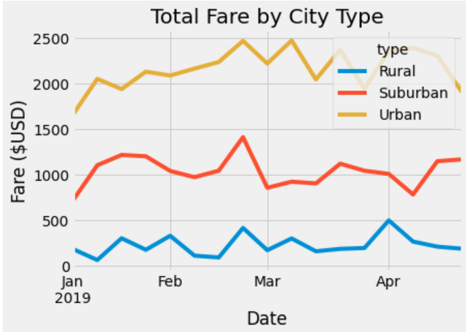
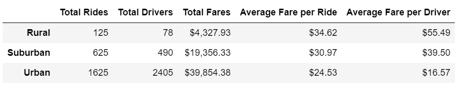

# PyBer Analysis

## Overview of Project
### Purpose of Project
In this project, I demonstrated my proficiency with various features in Pandas, Jupytier Notebook, and Matplotlib including: inspecting data, creating data series and data frames, merging data sets, performing calculations, and producing publication-quality figures to tell a visual story from the data. 

### Background of Project
Pyber, a ride-sharing app company, is trying to improve access to ride-sharing services and determine affordability for underserved neighborhoods. To provide recommendations to the CEO for addressing any disparities among the city types, a line graph was created to showcase the relationship between the type of city, number of riders and drivers, as well as the percentage of total fares. First, I created a summary DataFrame of the ride-sharing data by city type using Python and Pandas. Then, I created a multiple-line chart that shows the total weekly fares for each city type using Pandas and Matplotlib. Finally, I summarized how the data differs by city type and how those differences can be used by decision-makers at PyBer.

---
## Results 
There are many differences in ride-sharing data among the different city types. The multi-line chart below shows the total fares by city type. This chart reveals the trend of urban, suburban, and rural lines running parallel to one another with urban cities out earning suburban cities by approximately $1,000 and suburban cities out earning rural cities by approximately $1,000. Thus, there is about a $2,000 gap between the highest earner (urban cities) and the lowest one (rural cities). 

Diving deeper, the data in the table below uncovers the disparities among the city types. Predictably, urban cities account for a greatest number of riders, number of drivers, and total fare. Suburban cities account for the second most and rural cities account for the lowest across the three categories. However, these trends are reversed when comparing average fare per rider and average fare per driver by city type. 

**Average Fare Per Rider**
* Rural riders are paying the highest fares 
* The difference between rural (highest) and suburban (lowest) cities is $10.09
* The average rural driver rider pays about 1.4 times the amount of an urban rider 

**Average Fare Per Driver**
* Rural drivers are earning the highest fares 
* The difference between rural (highest) and suburban (lowest) cities is $38.92
* The average rural driver earns more than 3 times the amount of an urban driver per ride 
  * In other words, if an urban driver completes 3 rides, they will earn less than a rural driver who completes 1 

---
## Summary 
The disparities among the city types are apparent when comparing average fare per rider and average fare per driver. If you consider an average trip, a rural rider pays 1.4 times more than an urban rider while the rural driver of that trip earns over 3 times more than the urban driver. Given these difference, new questions emerge: 
* Are drivers being paid equitably for their time?
 * How long (in minutes) is the average ride by city type? 
 * How many rides does the average driver complete in day?
* If average fare for rural riders and drivers should be higher, what is the appropriate proportion compared to urban cities?

More information is needed to move forward. Before deciding to increase or decrease rates in any of the city types, Pyber should gather information about the average length of a ride in minutes. This would allow Pyber to make a more equitable decision when comparing the average fare per driver. After that analysis, if Pyber determines a fare adjustment is necessary, the next step will be to determine how an increased or decreased fare will affect supply and demand and ultimately Pyber's overall profit. 

